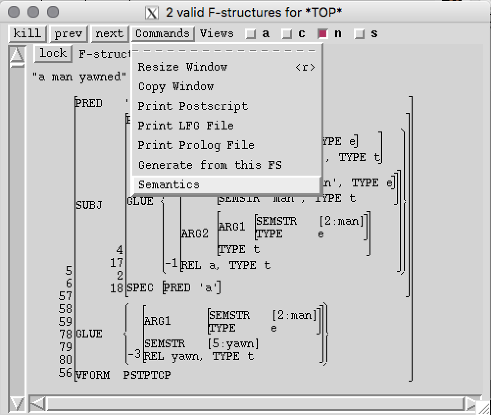
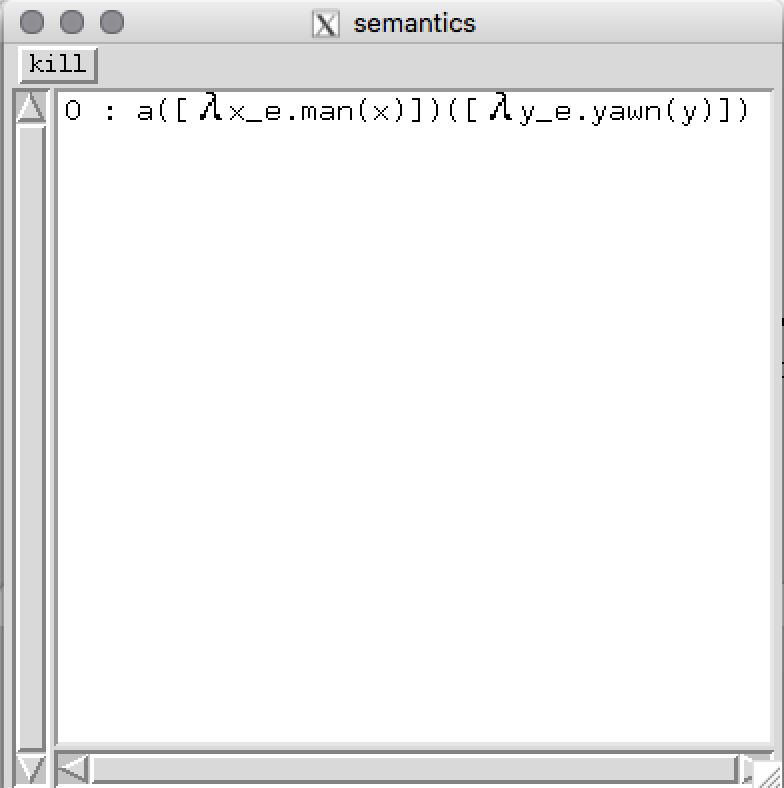
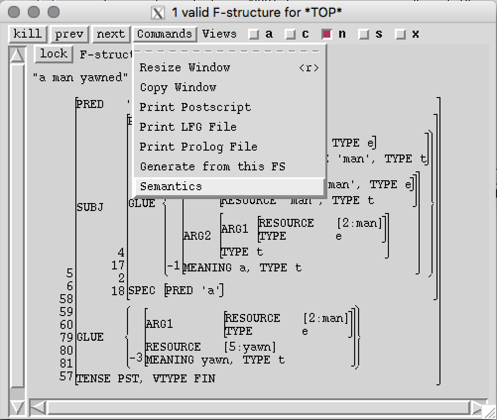
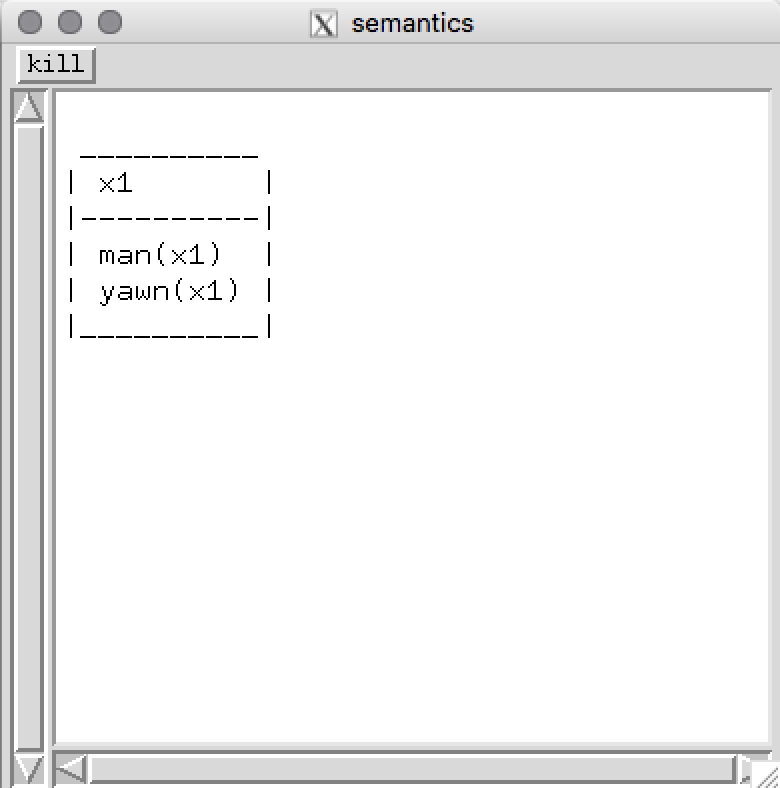

# XLE+Glue

This code makes it possible to call the Glue Semantics Workbench (GSWB) from XLE.
The folders `grammars/` and `grammars_concept/` contain some sample XLE grammars (see the descriptions in "Relevant content").
The folder `src/` contains Prolog procedures that translate the glue premises in an f-structure to strings that are formatted such that they can be read by the GSWB. 
The file `glue.tcl` adds a command to the XLE GUI that allows you to run the Prolog procedures and the GSWB and return the result.

Confirmed functional* for:

- MacOS 10.13.6 (High Sierra) 
- Ubuntu 16.04
- Ubuntu 14.04 
- Windows 7
- Windows 10

*Given the requirements are met 


# Licence information

XLE+Glue is distributed under the terms of the GNU General Public License version 3 (http://www.gnu.org/licenses/).

# Relevant content

- `gpl-3.0.txt`:
A copy of GNU GPL 3 licence
- `Manual_for_XLE_Glue_system.pdf`:  
A detailed description of the system expanding on this README
- `src/glue.tcl`:  
Adds XLE+Glue functionality to XLE; serves as interface for XLE, Prolog and Java 
- `src/extract_analysis.pl`:  
Part of the system that extracts and rewrites glue premises from AVMs into strings 
- `src/premises.pl`:   
Part of the system that extracts and rewrites glue premises from AVMs into strings
- `src/transfer_glue_premises.pl`:   
Part of the system that extracts and rewrites glue premises from AVMs into strings
- `src/boxer/alphaConversionDRT.pl`:
Part of the Boxer system used to provide DRT mode
- `src/boxer/betaConversionDRT.pl`:
Part of the Boxer system used to provide DRT mode
- `src/boxer/errors.pl`:   
Part of the Boxer system used to provide DRT mode
- `src/boxer/mergeDRT.pl`:   
Part of the Boxer system used to provide DRT mode
- `src/boxer/printDrs.pl`:   
Part of the Boxer system used to provide DRT mode
- `elisp/backquote-region.el`:  
An emacs module aimed at making it easier to format strings for use with XLE+Glue (see the description in the manual)
- `xlerc`:  
For loading the grammar and setting up environment variables for the semantic system
- `grammars/glue-basic.lfg`:  
A sample grammar that encodes glue premises in the f-structure
- `grammars/glue-basic-semstr.lfg`:    
A sample grammar that encodes glue premises in the s-structure
- `grammars/glue-basic-semparser.lfg`:   
A sample grammar that makes use of the semantic parser functionality of the GSWB
- `grammars/glue-basic-flat-encoding.lfg`:    
A sample grammar that uses the alternative string-based, flat encoding of glue premises (in the f-structure)
- `grammars_concept/glue-basic-semparser_ND.lfg`:    
A proof-of-concept grammar that uses the semantic parser functionality of the GSWB to derive semantic representations based on Neo-Davidsonian event semantics
- `grammars_concept/glue-basic-drt.lfg`:   
A proof-of-concept grammar that uses the Prolog-mode of the GSWB to produce semantic representations based on Boxer-style lambda-DRT.
- `testfile.lfg`:
A small testsuite


# Requirements

Download (clone) this repository to your computer. Once all the requirements listed below are met, run the XLE from the repository folder.
- Glue Semantics Workbench (GSWB) .jar file. It is part of this repository. Else, clone https://github.com/Mmaz1988/GlueSemWorkbench_v2 and produce your own .jar file.
- The GSWB jar file requires Java. [OpenJDK](https://jdk.java.net/13/) is used for development of GSWB. GSWB was also tested with oracle java 8. Feedback for other platforms is appreciated.
- SWI-Prolog (for translating f-structure premises to premise strings; The latest stable release is recommended; SWI-Prolog 6.x and older are not compatible with the present system.
- Xerox Linguistics Environment (XLE). The project is designed to be independent of XLE version, but feedback is welcome.
- When installing Java and SWI-Prolog make sure that the respective binaries are added to the `$PATH` variable. This holds for both windows and unix systems.  


# Setting up the system

Most relevant parameters are set in the `xlerc` file contained in the repository.

- The first step is to load an appropriate grammar using the `defaultGlueParser` parameter – the `glue-basic.lfg` sample grammar is loaded by default:

```
#Here the grammar is loaded 
set defaultGlueParser [relpath grammars/glue-basic.lfg]
```

- Different grammars use different GSWB output modes set using the `semParser` parameter:

```
# activate semantic parser (0: no parsing / 1: semantic Parsing / 2: Prolog)
set semParser 0
```

The default output mode (`0`) encodes functional application by concatenating functor and argument and wrapping the argument in parentheses – it is used with these grammars: `glue-basic.lfg`, `glue-basic-semstr.lfg`, `glue-basic-flat-encoding.lfg`. Semantic parsing mode (`1`) makes it possible to use a string-encoding that can be translated into semantic structures by the GSWB – it is used with these grammars: `glue-basic-semparser.lfg`, `glue-basic-semparser_ND.lfg`. Prolog output mode (`2`) uses the Prolog version of lambda-calculus presented in the books by Patrick Blackburn and Johan Bos on computational semantics – it is used with this grammar: `glue-basic-drt.lfg`.

The following table provides a summary of settings required by particular grammars:
| grammar | `semParser` | `processDRT` |
| ------------- | ------------- | ------------- |
| `glue-basic.lfg` | `0` | `0` |
| `glue-basic-semstr.lfg` | `0` | `0` |
| `glue-basic-flat-encoding.lfg` | `0` | `0` |
| `glue-basic-semparser.lfg` | `1` | `0` |
| `glue-basic-semparser_ND.lfg` | `1` | `0` |
| `glue-basic-drt.lfg` | `2` | `1` |

- GSWB can process output from grammars that encode meaning in terms of lambda-DRT. To use this option, set the `processDRT` parameter to `1`: 

```
# activate DRT mode (1/0); requires Prolog parsing! 
set processDRT 1
```

The output changes to the boxer-style DRS graphical representation. This only works if an appropriate grammar is loaded (`glue-basic-drt.lfg`)!

- The `solutionOnly` parameter determines whether the GSWB provides only the solution of the glue derivation (`1`) or detailed output of the proof (`0`):

```
#detailed output
set solutionOnly 1
```

- The following parameters make it possible to change font or font size (in the semantics window):

```
#set font
set outputfont Courir
set fontsize 18
```

- The project contains a version of the GSWB, however, you can 
specify the path to your own version of the GSWB in `src/glue.tcl` at your own risk (see below).  

```
#Set path of gswb
set gswbpath "glueSemWorkbench2.jar"
```


# Running the system

- The next step is to navigate to the top-level folder of the project (it contains the `xlerc` file) via some shell (e.g. Terminal for Linux/MacOS, PowerShell for Windows).
Then run XLE. The result should look something like the following: 

```
red-queen:gluegrammar red_queen$ xle
XLE loaded from xle.
XLEPATH = /Applications/xle-intelmac64-2017-09-25.
Copyright (c) 1993-2001 by the Xerox Corporation and
Copyright (c) 2002-2011 by the Palo Alto Research Center.
All rights reserved. This software is made available AS IS,
and PARC and the Xerox Corporation make no warranty about
the software, its performance or its conformity to any specification.
XLE release of Sep 25, 2017 21:02.
Type 'help' for more information.
loading /Users/red_queen/Projects/gluegrammar/grammars/glue-basic.lfg...
Grammar has 8 rules with 24 states, 27 arcs, and 27 disjuncts (27 DNF).
MORPHOLOGYCONFIGFILE = /Applications/xle-intelmac64-2017-09-25/bin/default-morph-config.

Morph transducer files relative to /Applications/xle-intelmac64-2017-09-25/bin/

0.005 CPU seconds
/Users/red_queen/Projects/gluegrammar/grammars/glue-basic.lfg loaded
Grammar last modified on Oct 08, 2020 09:35.
Debug mode is active.
/Users/red_queen/Projects/gluegrammar/xlerc loaded.
% 
```
If this succeeds you can parse a sentence as usual in XLE.

```
% parse "a man yawned"
parsing {a man yawned}
2 solutions, 0.000 CPU seconds, 0.000MB max mem, 26 subtrees unified
```
- The f-structure window "Commands" menu should now contain an entry called "Semantics". Clicking on this button should generate a window which contains the result of the glue derivation (including the underlying premises and their compiled counterpart, the agenda, if `solutionOnly` is set to `0`). Note that the example below uses a simple string to represent the semantic side of a glue premise. Semantic parsing is possible but requires a specific string encoding. More information can be found in the manual. 


# Command 



# Expected output
- The default output (`set solutionOnly 1`) consists only of the solution given by the prover:

- The detailed ouput (`set solutionOnly 0`) looks like this:

- The DRT-mode output looks like this:


# Acknowledgements 
This project is joint work between Mary Dalrymple and Agnieszka Patejuk (University of Oxford) and Mark-Matthias Zymla (University of Konstanz). The sample grammars are provided by Mary Dalrymple and Agnieszka Patejuk. Else, the individual files specify the responsible author. The GSWB is currently maintained by Mark-Matthias Zymla.
