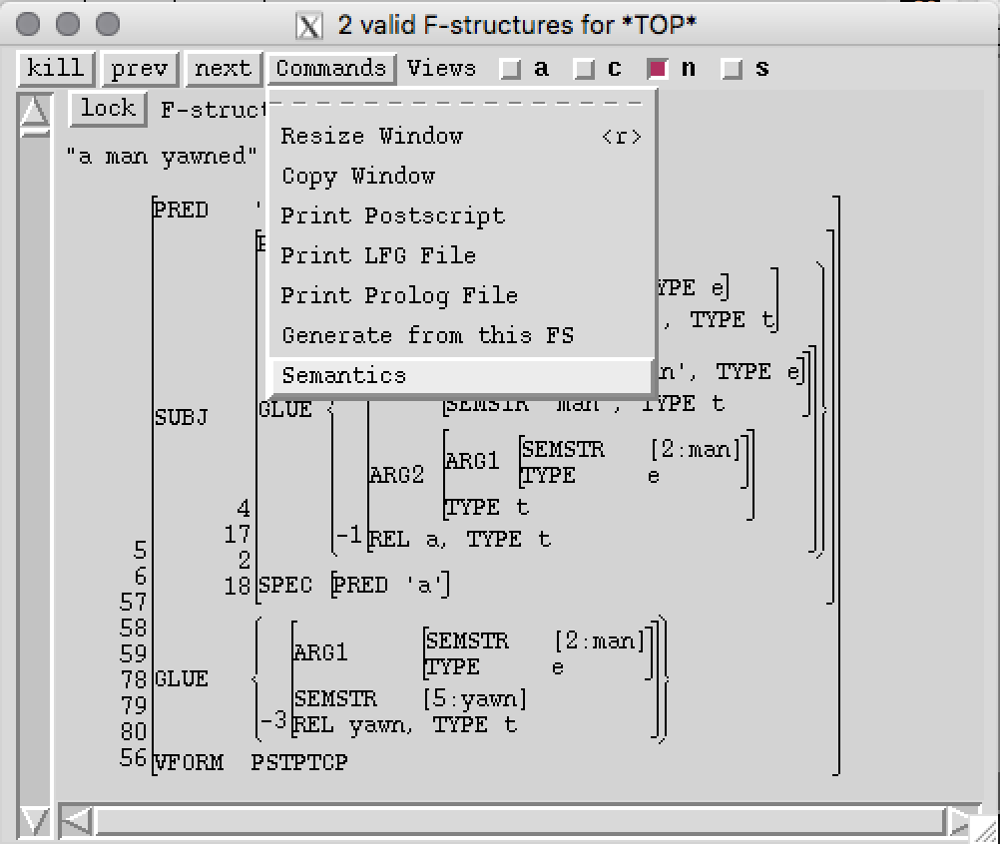
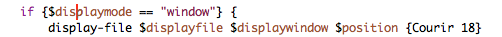

# xle-glueworkbench-interface
This code makes it possible to call the Glue semantics workbench (GSWB) from XLE.
The project contains a sample xle grammar that encodes Glue premises in the f-structure.
The folder /src contains prolog procedures that translate the Glue premises in an f-structure to strings
that are formatted such that they can be read by the Glue semantics workbench. 
The file glue.tcl adds a command to the XLE GUI that allows you to run the PROLOG procedures and the Glue semantics workbench and return the result.

Confirmed functional* for:

- MacOS 10.13.6 (High Sierra) 
- Ubuntu 16.04
- Ubuntu 14.04 
- Windows 7
- Windows 10


*Given the requirements are met 

# Relevant content

- src/glue.tcl:  
Adds XLE+Glue functionality to XLE; serves as interface for XLE, Prolog and Java 
- src/extract_analysis.pl:  
Part of the system that extracts and rewrites glue premises from avms into strings 
- src/premises.pl:   
Part of the system that extracts and rewrites glue premises from avms into strings
- src/transfer_glue_premises.pl:   
Part of the system that extracts and rewrites glue premises from avms into strings
- xlerc:  
For loading the grammar and setting up environment variables for the semantic system
- glue-basic.lfg:  
A simple grammar that encodes glue premises in the f-structure
- blue-basic-semstr.lfg  
A simple grammar that encodes glue premises in the s-structure

# Requirements

Download (clone) this repository to your computer. Once all the requirements listed below are met, run the XLE from the repository folder.
- Glue semantics workbench .jar file. It is part of this repository. Else, clone https://github.com/Mmaz1988/GlueSemWorkbench_v2 and produce your own .jar file. Since the project has been created with IntelliJ, I recommend to use that editor to build the project. 
- The GSWB jar file requires Java. [OpenJDK](https://jdk.java.net/13/) is used for development of GSWB. GSWB was
also tested with oracle java 8. Feedback for other platforms is appreciated.
- SWI-Prolog (for translating f-structure premises to premise strings; The latest stable release is recommended; SWI-Prolog 6.x and older are not compatible with the present system. Currently, there is an issue with the SWI-Prolog website where the download site is marked as dangerous by some browsers).
- Xerox Linguistics Environment (XLE). The project is designed to be independent of XLE version, but feedback is welcome.
- When installing Java and SWI-Prolog make sure, that the respective binaries are added to the $PATH variable. This holds for both windows and unix systems.  

# Setting up the system

- Download the project to your computer. No specific path is necessary, as long as you have properly set up XLE and SWI-Prolog. This means, you should have added the relevant binaries to your $PATH file, for example, in .bash_profile. For further assistance refer to the respective documentations.


The project contains a version of the GSWB, however, if you are developing on both the XLE side, as well as the prover side, you can 
specify the path to your own version of the GSWB in src/glue.tcl, where "Run Java Glue
prover" is written. Replace glueSemWorkbench2.jar with
some/directory/glueSemWorkbench2.jar

```
	#Run Java Glue prover; jar file relative to execution as above 
	eval exec java [list -jar glueSemWorkbench2.jar \
			-i $outputfile -o $displayfile]
```

- The GSWB allows for activation of semantic parsing by the GSWB. This variable is set in the xlerc file. Simply change the value in the following line of code from 0 to 1.

```
# activate semantic parser (1/0)
set semParser 0
```


# Running the system

The next step is to navigate to the top-level folder of the project via some shell (e.g. Terminal for MacOS, PowerShell for Windows) (the top level folder contains the xlerc file). 
Then simply run XLE. The result should look something like the following: 

```
lap0987:gluegrammar red_queen$ xle
XLE loaded from xle.
XLEPATH = /Applications/xle-2009-09-18.
Copyright (c) 1993-2001 by the Xerox Corporation and
Copyright (c) 2002-2009 by the Palo Alto Research Center.
All rights reserved. This software is made available AS IS,
and PARC and the Xerox Corporation make no warranty about
the software, its performance or its conformity to any specification.
XLE version 2.6.5 (built Sep 16, 2009 16:07 -0700)
Type 'help' for more information.
loading /Users/red_queen/Projects/gluegrammar/glue-basic.lfg...
Grammar has 8 rules with 22 states, 21 arcs, and 21 disjuncts (21 DNF).

(re)Indexing lexicon section ( ENGLISH BASIC ) for  parse 
MORPHOLOGYCONFIGFILE = /Applications/xle-2009-09-18/bin/default-morph-config.

Morph transducer files relative to /Applications/xle-2009-09-18/bin/

0.010 CPU seconds
/Users/red_queen/Projects/gluegrammar/glue-basic.lfg loaded
Grammar last modified on Aug 28, 2019 09:30.
/Users/red_queen/Projects/gluegrammar/xlerc loaded.
% 
```
If this succeeds you can simply parse a sentence as usual in XLE.

```
% parse "a man yawned"
parsing {a man yawned}
2 solutions, 0.000 CPU seconds, 0.000MB max mem, 26 subtrees unified
```
The f-structure window "Commands" menu should now contain an entry called "Semantics". Clicking on this button should generate a window which contains the result of the Glue derivation including the underlying premises and their compiled counterpart, the agenda. Note that the example below uses pseudo-semantics to illustrate the functionality of the workbench.

# Command 



# Expected output


To change font or font size, you can change the following piece of code towards the end of the glue.tcl file.



# Acknowledgements 
This project is joint work between Mary Dalrymple and Agnieszka Patejuk (Oxford University) and Mark-Matthias Zymla (University of Konstanz). The grammar glue-basic.lfg is provided by Mary Dalrymple. Else, the individual files specify the responsible author. The GSWB is currently maintained by Mark-Matthias Zymla.
